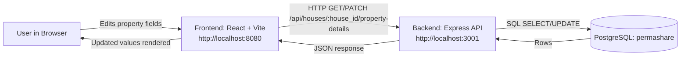

## App Summary
Permashare solves the problem of coordinating shared home ownership data across multiple co-owners. The primary user is a co-ownership team member who needs transparent, up-to-date property financial details. The product provides a property details page where the team can view and edit key shared values used for planning and affordability. In the current vertical slice, users can edit four fields: current salary pool, deposit goal, mortgage rate, and house value. Changes are sent from the React frontend to an Express API and persisted in PostgreSQL. On reload, the page fetches the latest values from the database so users always see saved state. This creates a complete end-to-end flow from UI interaction to durable data storage.

## Tech Stack
- Frontend: React 18 + TypeScript, Vite, Tailwind CSS, shadcn/ui, Framer Motion
- Backend: Node.js + Express
- Database: PostgreSQL (queried through `pg` in the backend)
- Authentication: Not implemented in this slice
- External services/APIs: None required for this slice

## Architecture Diagram


## Prerequisites
Install the following before running locally:
- Node.js (includes npm): https://nodejs.org/en/download
- PostgreSQL (server + CLI tools): https://www.postgresql.org/download/
- `psql` available in your PATH (or use full path to `psql`)

Verify installation:
```bash
node -v
npm -v
psql --version
```

## Installation and Setup
1. Clone the repository and move into it:
```bash
git clone <your-repo-url>
cd share-harmony
```

2. Install backend dependencies:
```bash
cd backend
npm install
cd ..
```

3. Install frontend dependencies:
```bash
cd frontend
npm install
cd ..
```

4. Create the PostgreSQL database:
```bash
createdb -h localhost -p 5432 -U colelatour permashare
```
If it already exists, continue to the next step.

5. Run schema and seed scripts:
```bash
psql -h localhost -p 5432 -U colelatour -d permashare -f db/create_database.sql
psql -h localhost -p 5432 -U colelatour -d permashare -f db/seed.sql
```

6. Configure backend environment variables in `backend/.env`:
```env
PORT=3001
PGHOST=localhost
PGPORT=5432
PGDATABASE=permashare
PGUSER=colelatour
PGPASSWORD=
DATABASE_URL=postgresql://colelatour@localhost:5432/permashare
```

## Running the Application
Start backend (terminal 1):
```bash
cd backend
npm run dev
```

Start frontend (terminal 2):
```bash
cd frontend
npm run dev
```

Open:
- Frontend UI: http://localhost:8080
- Backend health check: http://localhost:3001/api/health

## Verifying the Vertical Slice
1. Open `http://localhost:8080/property`.
2. Edit one of these fields and click Save:
- Current Salary Pool
- Deposit Goal
- Mortgage Rate
- House Value
3. Confirm DB update using `psql`:
```bash
psql -h localhost -p 5432 -U colelatour -d permashare -c 'SELECT house_id, current_salary_pool, deposit_goal, mortgage_rate, house_value FROM "HouseDetails" WHERE house_id = 1;'
```
4. Refresh the property page in the browser.
5. Confirm the edited value is still displayed after refresh (proves persistence from PostgreSQL, not local UI state).
